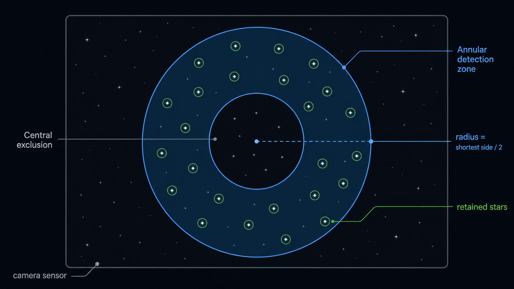

# Manual Image Rotator for N.I.N.A.

Manual Image Rotator is a N.I.N.A. plugin that exposes a virtual rotator to help manually adjust a camera angle.

The plugin does not drive any motor. It uses the camera already connected in N.I.N.A., regularly captures images, measures the field rotation relative to a reference frame, and updates the virtual rotator position. From N.I.N.A.'s point of view, it behaves like a regular rotator: `Move mechanical position` stays active while the user physically rotates the camera, then completes when the target is reached.

The French documentation is available in `README_FR.md`.

## Download

Prebuilt ZIP packages are intended to be published from the GitHub Releases page:

```text
https://github.com/cabfire/manual_image_rotator/releases
```

Download the latest `ManualImageRotator.NINA-*.zip`, close N.I.N.A., then extract it into:

```text
%LOCALAPPDATA%\NINA\Plugins\3.0.0
```

After extraction, the plugin should be installed in:

```text
%LOCALAPPDATA%\NINA\Plugins\3.0.0\Manual Image Rotator
```

Restart N.I.N.A., then select `Manual Image Rotator` in the `Rotator` equipment.

## User Workflow

1. Connect the camera in N.I.N.A.
2. Go to the `Rotator` equipment and select `Manual Image Rotator`.
3. Connect the virtual rotator.
4. Adjust the options if needed through the gear/settings button:
   - exposure time,
   - refresh interval,
   - angular tolerance,
   - debug logs,
   - current position reset.
5. Enter a `Target mechanical position`.
6. Click `Move mechanical position`.
7. Physically rotate the camera or manual rotator.
8. Follow the guidance window:
   - current position,
   - target position,
   - blue needle for the measured angle,
   - green target when the tolerance is reached.
   - matched stars,
   - measurement quality colored green, orange, or red.
9. When the target is reached, the plugin automatically completes the move.

The `OK` button in the guidance window can also be used to accept the current position before the target is reached exactly.

## What N.I.N.A. Displays

N.I.N.A.'s rotator screen is a generic UI shared by rotators. The plugin provides values and actions, but it does not directly control the layout of that screen.

Plugin-managed elements:

- `Is moving`
- `Reverse`
- `Mechanical position`
- `Target mechanical position`
- `Move mechanical position`
- `SetupDialog` through the gear/settings button

The `Reinit current position` button is therefore placed in the plugin settings, not in the native rotator UI.

## Measurement Algorithm

The image-processing core is intentionally independent from N.I.N.A. so it can be tested outside the application.

### 1. Image Capture

`NinaRotationImageSource` uses `IImagingMediator` to request a `SNAPSHOT` image from N.I.N.A. with the configured exposure time.

N.I.N.A. images are converted to `RotationFrame`:

- width,
- height,
- 16-bit pixels,
- RGB to luminance conversion when needed.

### 2. Star Detection

`StarCentroidDetector` detects stars in each image:



- background estimation by pixel sampling,
- threshold = `mean + 4 * sigma`,
- local maximum detection,
- centroid calculation over a 5x5 window,
- selection inside a circular zone centered on the image,
- outer radius = shortest image side / 2,
- inner radius = outer radius * `CentralExclusionPercent` / 100,
- sorting by decreasing flux,
- keeping the `DetectedStars` brightest stars in that annular zone,
- minimum 12 px spacing between retained stars to avoid keeping multiple local maxima around the same star.

The plugin does not rely on a single star. It uses a set of centroids, which makes the measurement much more robust.

### 3. Matching and 2D Transform

`RotationEstimator` compares the reference image and the current image.

It builds star pairs in both images, ignores pairs that are too short, then tests similarity transforms:

- rotation,
- X/Y translation,
- scale close to 1.

For each hypothesis, it projects the reference stars into the current image and counts matches within a 10-pixel tolerance. The best transform is the one that maximizes the number of matched stars, then minimizes RMS error.

Main parameters:

- minimum pair length: 30 px,
- maximum scale change: 20%,
- inlier tolerance: 10 px,
- minimum: 3 matched stars.

### 4. Measurement Quality

Each measurement produces:

- angle in degrees,
- matched star count,
- RMS error in pixels,
- quality between 0 and 1,
- X/Y translation,
- scale.

Quality is displayed in the guidance window as a visual confidence indicator. It does not block the measurement loop: medium quality can still be usable when the matched star count remains sufficient and the needle follows the movement correctly.

### 5. Frame Rejection

Before a new measurement is allowed to update the rotator angle, it is checked against three rejection rules:

- `MatchedStars < MinimumMatchedStars` rejects frames with too few reliable matches;
- `Quality < MinimumQuality` rejects low-confidence transforms;
- `AngleJump > MaximumAngleJumpDegrees` rejects sudden jumps from the last accepted angle.

When a frame is rejected, the guidance window still displays its metrics and a status such as `Rejected - angle jump`, but the current angle and blue needle stay on the last accepted measurement. This avoids frightening 180-degree needle jumps caused by one bad exposure while still making the rejection visible.

Accepted frames show `Status: Accepted` and update the current angle normally.

### 6. Rotation Loop

`ManualRotationSession`:

1. captures a reference image;
2. captures a current image;
3. measures the relative angle;
4. computes `currentAngle = initialAngle + measuredRotation`;
5. computes `delta = targetAngle - currentAngle`, normalized to `[-180 deg, +180 deg]`;
6. rejects unstable frames or accepts the measurement;
7. publishes the state to the driver and UI window;
8. completes if `abs(delta) <= tolerance`;
9. waits for the configured interval, then loops again.

## Settings

Settings are stored in:

```text
%LOCALAPPDATA%\NINA\ManualImageRotator\settings.txt
```

Current values:

| Setting | Default | Bounds |
| --- | ---: | ---: |
| ExposureSeconds | 3.0 s | 0.001 to 600 s |
| RefreshIntervalSeconds | 1.0 s | 0.1 to 600 s |
| ToleranceDegrees | 0.25 deg | 0.01 to 10 deg |
| CentralExclusionPercent | 20% | 0 to 80% |
| DetectedStars | 16 | 3 to 100 |
| MinimumQuality | 0.25 | 0 to 1 |
| MinimumMatchedStars | 4 | 3 to DetectedStars |
| MaximumAngleJumpDegrees | 60 deg | 1 to 180 deg |
| Reverse | false | true/false |
| DebugLogging | false | true/false |

`Reverse` is driven by N.I.N.A.'s native rotator toggle.
`MinimumQuality`, `MinimumMatchedStars`, and `MaximumAngleJumpDegrees` reject unstable measurements before they update the displayed rotator angle.
`DebugLogging` enables detailed capture, measurement, quality, and synchronization logs. It is disabled by default.

## Requirements

To use the plugin:

- Windows,
- N.I.N.A. 3.x installed,
- a camera connected in N.I.N.A.,
- a field containing enough detectable stars.

To build:

- .NET SDK 8,
- Visual Studio Build Tools 2022 or Visual Studio Community 2022,
- `Desktop development with C++/.NET desktop build tools` workload or equivalent components,
- `.NET Framework 4.8 SDK` and `.NET Framework 4.8 targeting pack` for the historical harness,
- N.I.N.A. installed in:

```text
C:\Program Files\N.I.N.A. - Nighttime Imaging 'N' Astronomy
```

The NINA 3 project directly references N.I.N.A. DLLs from this folder.

## Build

Build the N.I.N.A. 3 plugin:

```powershell
dotnet build .\src\ManualImageRotator.NINA\ManualImageRotator.NINA.NINA3.csproj -c Debug --no-restore
```

Main output:

```text
src\ManualImageRotator.NINA\bin\Debug\net8.0-windows\ManualImageRotator.NINA.dll
```

A `System.Text.Json` warning may appear because of different N.I.N.A./.NET references. It is known and does not prevent the build.

## Local Installation in N.I.N.A.

For normal use, prefer the ZIP from the GitHub Releases page.

For local development, close N.I.N.A., then copy the generated files to the plugin folder:

```powershell
$target = "$env:LOCALAPPDATA\NINA\Plugins\3.0.0\Manual Image Rotator"
New-Item -ItemType Directory -Force -Path $target
Copy-Item .\src\ManualImageRotator.NINA\bin\Debug\net8.0-windows\ManualImageRotator.NINA.dll -Destination $target -Force
Copy-Item .\src\ManualImageRotator.NINA\bin\Debug\net8.0-windows\ManualImageRotator.NINA.pdb -Destination $target -Force
Copy-Item .\src\ManualImageRotator.NINA\bin\Debug\net8.0-windows\ManualImageRotator.NINA.deps.json -Destination $target -Force
```

Then restart N.I.N.A. and select `Manual Image Rotator` in the `Rotator` equipment.

## Release ZIP

The manual installation ZIP should contain a top-level `Manual Image Rotator` folder with:

```text
Manual Image Rotator/
  ManualImageRotator.NINA.dll
  ManualImageRotator.NINA.deps.json
  ManualImageRotator.NINA.pdb
```

The `.pdb` file is optional for runtime, but useful when diagnosing N.I.N.A. logs.

## Tests Outside N.I.N.A.

The harness can test the algorithm without launching N.I.N.A.

Build:

```powershell
& "C:\Program Files (x86)\Microsoft Visual Studio\2022\BuildTools\MSBuild\Current\Bin\MSBuild.exe" .\tests\ManualImageRotator.Harness\ManualImageRotator.Harness.csproj /p:Configuration=Debug /v:minimal
```

Run synthetic tests:

```powershell
.\tests\ManualImageRotator.Harness\bin\Debug\ManualImageRotator.Harness.exe
```

Test with two image files:

```powershell
.\tests\ManualImageRotator.Harness\bin\Debug\ManualImageRotator.Harness.exe --reference starfield.png --current starfield_rotated.png --expected -12.5
```

Note: a positive rotation applied by Pillow may be measured as a negative angle, depending on the image coordinate convention.

## Test Image Generation

`starfield.py` generates a star field image and, when an angle is provided, a rotated version.

Example:

```powershell
python .\starfield.py --rotation 12.5
```

Default output files:

```text
starfield.png
starfield_rotated.png
```

## Project Structure

```text
src/ManualImageRotator.NINA/
  Equipment/
    ManualImageRotatorDriver.cs        IRotator driver
    ManualImageRotatorProvider.cs      N.I.N.A. equipment registration
    ManualImageRotatorSetupWindow.cs   Plugin settings
    ManualImageRotatorMoveWindow.cs    Live guidance window
    ManualImageRotatorSettings.cs      Settings persistence
  Imaging/
    StarCentroidDetector.cs            Centroid detection
    RotationEstimator.cs               Matching and rotation estimation
    RotationModels.cs                  Image/measurement models
  Services/
    ManualRotationSession.cs           Capture/measure/tolerance loop
    NinaRotationImageSource.cs         Capture via IImagingMediator

tests/ManualImageRotator.Harness/
  Program.cs                           Tests outside N.I.N.A.

starfield.py                           Test image generator
```

## Known Limitations

- The plugin depends on detected star quality: focus, noise, saturation, and exposure matter a lot.
- Large image translation is tolerated, but if too many stars leave the field, the measurement can become unstable.
- N.I.N.A.'s native rotator UI cannot be freely customized by this driver.
- Early acceptance through `OK` uses a temporary synchronization with the target so N.I.N.A. can complete the move correctly.
- The plugin is designed as a manual rotator assistant, not as a motorized ASCOM rotator.
