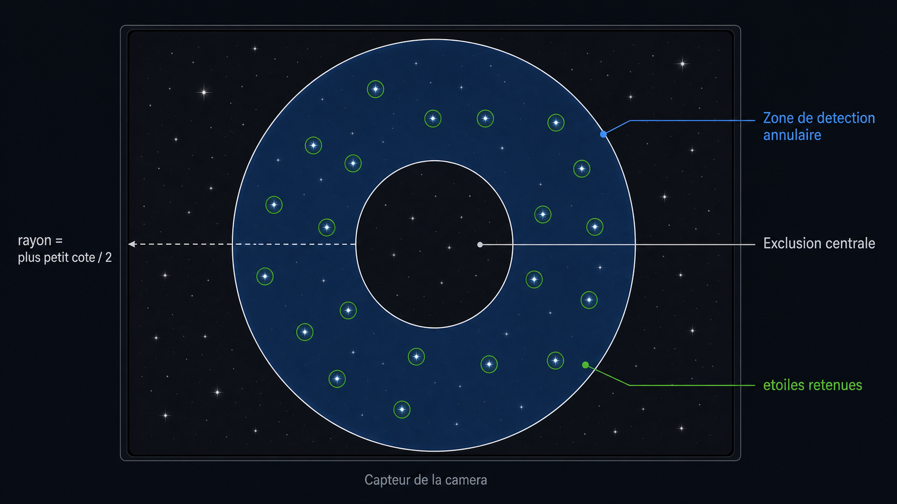

# Manual Image Rotator pour N.I.N.A.

Manual Image Rotator est un plugin N.I.N.A. qui expose un rotateur virtuel pour aider a regler manuellement l'angle d'une camera.

Le plugin ne pilote aucun moteur. Il utilise la camera deja connectee a N.I.N.A., capture regulierement des images, mesure la rotation du champ par rapport a une image de reference, puis met a jour la position du rotateur virtuel. Cote N.I.N.A., il se comporte donc comme un rotateur classique : `Move mechanical position` reste actif pendant que l'utilisateur tourne physiquement la camera, puis se termine quand la cible est atteinte.

## Telechargement

Les ZIP precompiles sont prevus pour etre publies depuis la page GitHub Releases :

```text
https://github.com/cabfire/manual_image_rotator/releases
```

Telecharger le dernier `ManualImageRotator.NINA-*.zip`, fermer N.I.N.A., puis l'extraire dans :

```text
%LOCALAPPDATA%\NINA\Plugins\3.0.0
```

Apres extraction, le plugin doit se trouver dans :

```text
%LOCALAPPDATA%\NINA\Plugins\3.0.0\Manual Image Rotator
```

Relancer N.I.N.A., puis selectionner `Manual Image Rotator` dans l'equipement `Rotator`.

## Fonctionnement utilisateur

1. Connecter la camera dans N.I.N.A.
2. Aller dans l'equipement `Rotator` et choisir `Manual Image Rotator`.
3. Connecter le rotateur virtuel.
4. Regler si besoin les options via la roue dentee :
   - temps d'exposition,
   - intervalle de rafraichissement,
   - tolerance angulaire,
   - logs de debug,
   - reinitialisation de la position courante.
5. Saisir une `Target mechanical position`.
6. Cliquer sur `Move mechanical position`.
7. Tourner physiquement la camera ou le rotateur manuel.
8. Suivre la fenetre de guidage :
   - position courante,
   - position cible,
   - aiguille bleue pour l'angle mesure,
   - cible en vert quand la tolerance est atteinte.
   - nombre d'etoiles matchees,
   - qualite de mesure coloree en vert, orange ou rouge.
9. Quand la cible est atteinte, le plugin termine automatiquement le mouvement.

Le bouton `OK` de la fenetre de guidage permet aussi d'accepter la position courante avant d'atteindre exactement la cible.

## Ce que N.I.N.A. affiche

L'ecran rotateur de N.I.N.A. est une UI generique commune aux rotateurs. Le plugin fournit les valeurs et les actions, mais ne controle pas directement la disposition de cet ecran.

Elements geres par le plugin :

- `Is moving`
- `Reverse`
- `Mechanical position`
- `Target mechanical position`
- `Move mechanical position`
- `SetupDialog` via la roue dentee

Le bouton `Reinit current position` est donc place dans les settings du plugin, pas dans l'UI native du rotateur.

## Algorithme de mesure

Le coeur image est volontairement independant de N.I.N.A. pour pouvoir etre teste hors application.

### 1. Capture des images

`NinaRotationImageSource` utilise `IImagingMediator` pour demander une image `SNAPSHOT` a N.I.N.A. avec le temps d'exposition configure.

Les images N.I.N.A. sont converties en `RotationFrame` :

- largeur,
- hauteur,
- pixels 16 bits,
- conversion RGB vers luminance si necessaire.

### 2. Detection d'etoiles

`StarCentroidDetector` detecte les etoiles sur chaque image :



- estimation du fond par echantillonnage des pixels,
- seuil = `mean + 4 * sigma`,
- detection des maxima locaux,
- calcul du centroide sur une fenetre 5x5,
- selection dans une zone circulaire centree sur l'image,
- rayon externe = plus petit cote de l'image / 2,
- rayon interne = rayon externe * `CentralExclusionPercent` / 100,
- tri par flux decroissant,
- conservation des `DetectedStars` etoiles les plus brillantes dans cette zone annulaire,
- distance minimale de 12 px entre deux etoiles retenues pour eviter de garder plusieurs maxima autour de la meme etoile.

Le plugin ne s'appuie donc pas sur une seule etoile. Il utilise un ensemble de centroides, ce qui rend la mesure beaucoup plus robuste.

### 3. Matching et transformation 2D

`RotationEstimator` compare l'image de reference et l'image courante.

Il construit des paires d'etoiles dans chaque image, ignore les paires trop courtes, puis teste des transformations de similitude :

- rotation,
- translation X/Y,
- scale proche de 1.

Pour chaque hypothese, il projette les etoiles de reference vers l'image courante et compte les correspondances dans une tolerance de 10 pixels. La meilleure transformation est celle qui maximise le nombre d'etoiles matchees, puis minimise l'erreur RMS.

Parametres principaux :

- longueur minimale de paire : 30 px,
- variation de scale maximale : 20%,
- tolerance inlier : 10 px,
- minimum : 3 etoiles matchees.

### 4. Qualite de mesure

Chaque mesure produit :

- angle en degres,
- nombre d'etoiles matchees,
- erreur RMS en pixels,
- qualite entre 0 et 1,
- translation X/Y,
- scale.

La qualite est affichee dans la fenetre de guidage comme indicateur visuel. Elle ne bloque pas la boucle de mesure : meme une qualite moyenne peut rester utilisable si le nombre d'etoiles matchees reste suffisant et si l'aiguille suit correctement le mouvement.

### 5. Boucle de rotation

`ManualRotationSession` :

1. capture une image de reference ;
2. capture une image courante ;
3. mesure l'angle relatif ;
4. calcule `currentAngle = initialAngle + measuredRotation`;
5. calcule `delta = targetAngle - currentAngle` normalise dans `[-180 deg, +180 deg]` ;
6. publie l'etat vers le driver et la fenetre UI ;
7. termine si `abs(delta) <= tolerance` ;
8. attend l'intervalle configure puis recommence.

## Reglages

Les settings sont stockes dans :

```text
%LOCALAPPDATA%\NINA\ManualImageRotator\settings.txt
```

Valeurs actuelles :

| Parametre | Defaut | Bornes |
| --- | ---: | ---: |
| ExposureSeconds | 0.05 s | 0.001 a 600 s |
| RefreshIntervalSeconds | 1.0 s | 0.1 a 600 s |
| ToleranceDegrees | 0.25 deg | 0.01 a 10 deg |
| CentralExclusionPercent | 20% | 0 a 80% |
| DetectedStars | 16 | 3 a 100 |
| Reverse | false | true/false |
| DebugLogging | false | true/false |

`Reverse` est pilote par le toggle natif N.I.N.A. du rotateur.
`DebugLogging` active les logs detailles de capture, mesure, qualite et synchronisation. Il reste desactive par defaut.

## Prerequis

Pour utiliser le plugin :

- Windows,
- N.I.N.A. 3.x installe,
- une camera connectee dans N.I.N.A.,
- un champ contenant assez d'etoiles detectables.

Pour compiler :

- .NET SDK 8,
- Visual Studio Build Tools 2022 ou Visual Studio Community 2022,
- workload `Desktop development with C++/.NET desktop build tools` ou composants equivalents,
- `.NET Framework 4.8 SDK` et `.NET Framework 4.8 targeting pack` pour le harness historique,
- N.I.N.A. installe dans :

```text
C:\Program Files\N.I.N.A. - Nighttime Imaging 'N' Astronomy
```

Le projet NINA 3 reference directement les DLL de N.I.N.A. depuis ce dossier.

## Compilation

Compiler le plugin N.I.N.A. 3 :

```powershell
dotnet build .\src\ManualImageRotator.NINA\ManualImageRotator.NINA.NINA3.csproj -c Debug --no-restore
```

Sortie principale :

```text
src\ManualImageRotator.NINA\bin\Debug\net8.0-windows\ManualImageRotator.NINA.dll
```

Un warning `System.Text.Json` peut apparaitre a cause de references N.I.N.A./.NET differentes. Il est connu et n'empeche pas la generation.

## Installation locale dans N.I.N.A.

Pour une utilisation normale, preferer le ZIP publie dans GitHub Releases.

Pour le developpement local, fermer N.I.N.A., puis copier les fichiers generes vers le dossier plugin :

```powershell
$target = "$env:LOCALAPPDATA\NINA\Plugins\3.0.0\Manual Image Rotator"
New-Item -ItemType Directory -Force -Path $target
Copy-Item .\src\ManualImageRotator.NINA\bin\Debug\net8.0-windows\ManualImageRotator.NINA.dll -Destination $target -Force
Copy-Item .\src\ManualImageRotator.NINA\bin\Debug\net8.0-windows\ManualImageRotator.NINA.pdb -Destination $target -Force
Copy-Item .\src\ManualImageRotator.NINA\bin\Debug\net8.0-windows\ManualImageRotator.NINA.deps.json -Destination $target -Force
```

Relancer ensuite N.I.N.A. et selectionner `Manual Image Rotator` dans l'equipement `Rotator`.

## ZIP de release

Le ZIP d'installation manuelle doit contenir un dossier racine `Manual Image Rotator` avec :

```text
Manual Image Rotator/
  ManualImageRotator.NINA.dll
  ManualImageRotator.NINA.deps.json
  ManualImageRotator.NINA.pdb
```

Le fichier `.pdb` est optionnel pour l'execution, mais utile pour diagnostiquer les logs N.I.N.A.

## Tests hors N.I.N.A.

Le harness permet de tester l'algorithme sans lancer N.I.N.A.

Compiler :

```powershell
& "C:\Program Files (x86)\Microsoft Visual Studio\2022\BuildTools\MSBuild\Current\Bin\MSBuild.exe" .\tests\ManualImageRotator.Harness\ManualImageRotator.Harness.csproj /p:Configuration=Debug /v:minimal
```

Lancer les tests synthetiques :

```powershell
.\tests\ManualImageRotator.Harness\bin\Debug\ManualImageRotator.Harness.exe
```

Tester avec deux images :

```powershell
.\tests\ManualImageRotator.Harness\bin\Debug\ManualImageRotator.Harness.exe --reference starfield.png --current starfield_rotated.png --expected -12.5
```

Note : une rotation positive appliquee par Pillow peut etre mesuree comme un angle negatif, selon la convention image utilisee.

## Generation d'images de test

`starfield.py` genere une image de champ d'etoiles et, si un angle est fourni, une version tournee.

Exemple :

```powershell
python .\starfield.py --rotation 12.5
```

Fichiers produits par defaut :

```text
starfield.png
starfield_rotated.png
```

## Structure du projet

```text
src/ManualImageRotator.NINA/
  Equipment/
    ManualImageRotatorDriver.cs        Driver IRotator
    ManualImageRotatorProvider.cs      Enregistrement equipement N.I.N.A.
    ManualImageRotatorSetupWindow.cs   Settings du plugin
    ManualImageRotatorMoveWindow.cs    Fenetre live de guidage
    ManualImageRotatorSettings.cs      Persistance des reglages
  Imaging/
    StarCentroidDetector.cs            Detection centroides
    RotationEstimator.cs               Matching et estimation de rotation
    RotationModels.cs                  Modeles image/mesure
  Services/
    ManualRotationSession.cs           Boucle capture/mesure/tolerance
    NinaRotationImageSource.cs         Capture via IImagingMediator

tests/ManualImageRotator.Harness/
  Program.cs                           Tests hors N.I.N.A.

starfield.py                           Generateur d'images de test
```

## Limites connues

- Le plugin depend de la qualite des etoiles detectees : mise au point, bruit, saturation et exposition jouent beaucoup.
- Une translation importante de l'image est toleree, mais si trop d'etoiles sortent du champ, la mesure peut devenir instable.
- L'UI rotateur native de N.I.N.A. n'est pas personnalisable librement par ce driver.
- L'acceptation anticipee par `OK` utilise une synchronisation temporaire avec la target pour que N.I.N.A. termine correctement le mouvement.
- Le plugin est concu comme aide au rotateur manuel, pas comme rotateur motorise ASCOM.
